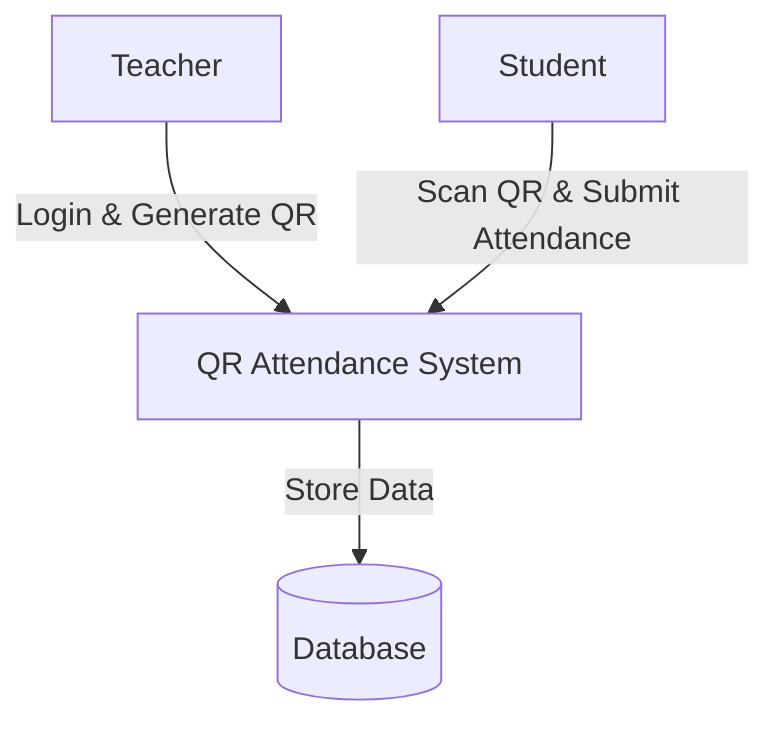
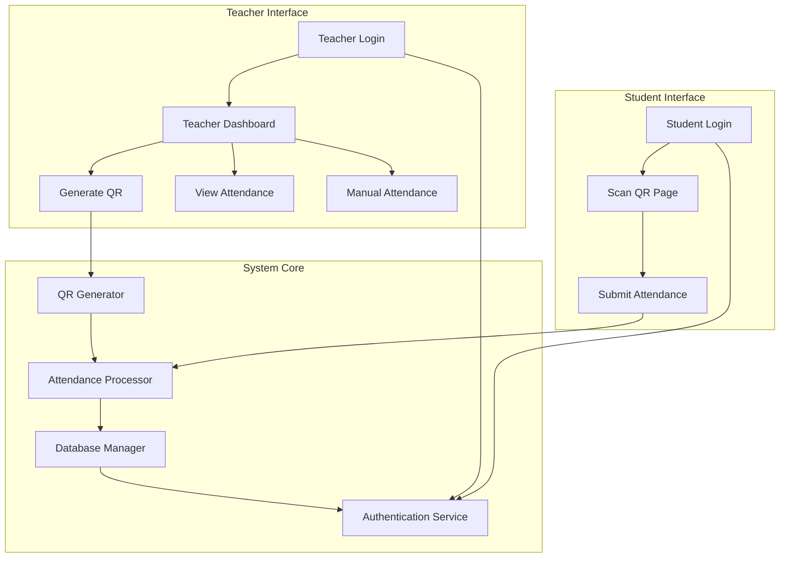
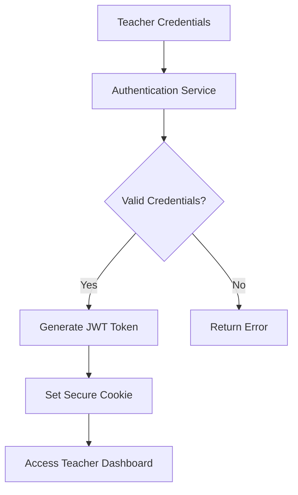
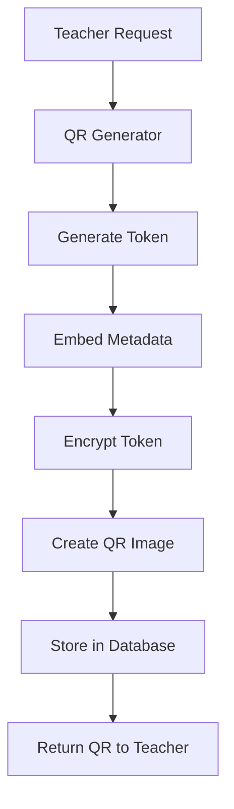
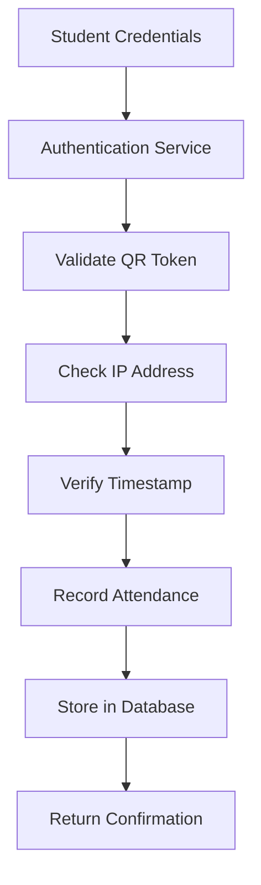
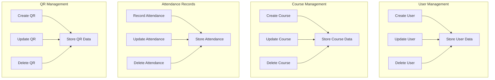

# QR Attendance System - Data Flow Diagram

## Context Level DFD (Level 0)

## Level 1 DFD

## Level 2 DFDs

### Level 2: Teacher Login Process

### Level 2: QR Generation Process

### Level 2: Student Attendance Process

### Level 2: Database Operations

## Data Flow Descriptions

### Level 0 Data Flows
1. Teacher → System
   - Input: Teacher credentials
   - Output: Access to teacher interface

2. Student → System
   - Input: Student credentials and QR token
   - Output: Attendance confirmation

3. System → Database
   - Input: All system data
   - Output: Data persistence

### Level 1 Data Flows
1. Teacher Login → Authentication
   - Input: Username, password
   - Output: JWT token

2. QR Generator → Database
   - Input: QR token, metadata
   - Output: Stored QR record

3. Student Attendance → Database
   - Input: Attendance record
   - Output: Stored attendance

### Level 2 Data Flows
1. Authentication Service
   - Input: Credentials
   - Output: JWT token

2. QR Generation
   - Input: Course details, timestamp
   - Output: Encrypted QR code

3. Attendance Recording
   - Input: QR token, student info
   - Output: Attendance confirmation

## External Entities
1. Teachers - System users who generate QR codes and manage attendance
2. Students - System users who scan QR codes and submit attendance
3. Database - Persistent storage for all system data

## Data Stores
1. Users - Stores teacher and student profiles
2. Courses - Stores course information and QR metadata
3. Attendance - Stores attendance records
4. QR Codes - Stores QR token information and expiry data
